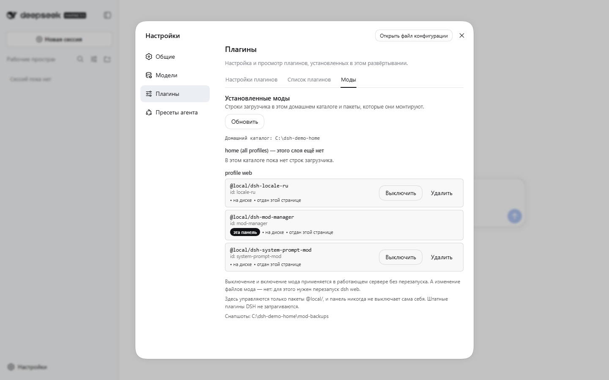
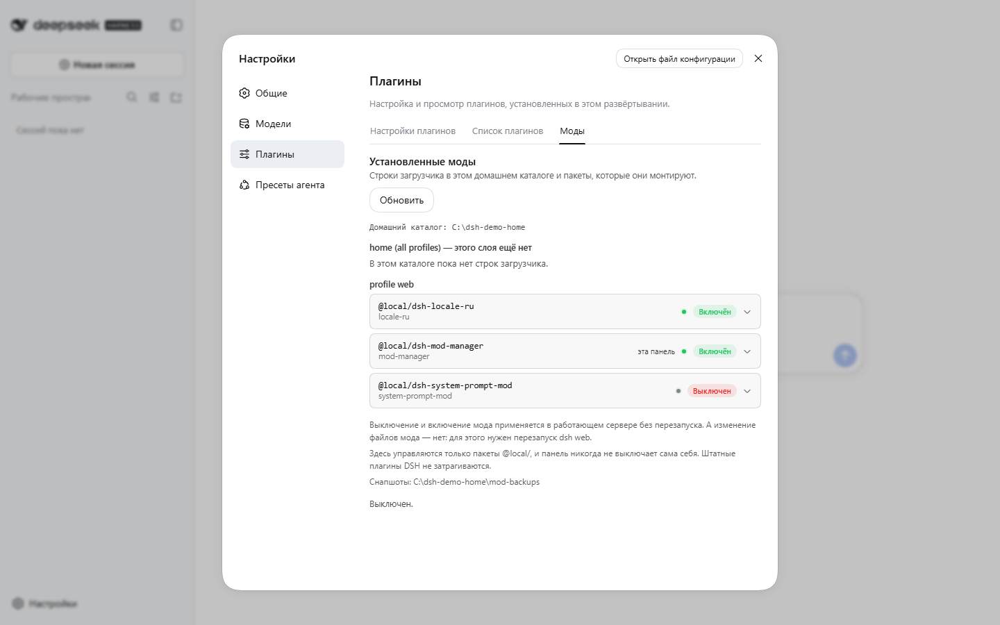
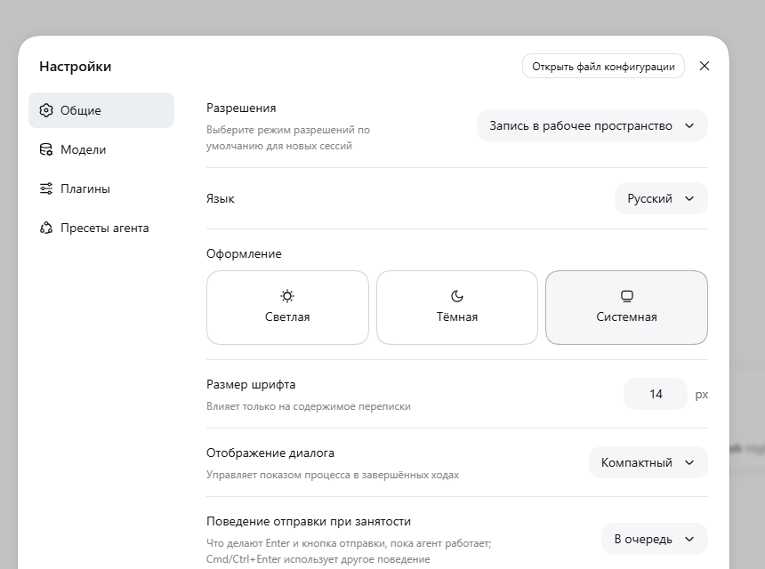

# Harness Mods

Плагины для **[харнесса агентов](https://github.com/deepseek-ai/deepseek-harness)** —
харнесса, браузерный интерфейс которого открывает команда `dsh web`.

> **Репозиторий:** <https://gitverse.ru/ubikon/dsh-mods>

В репозитории три мода:

| Мод | Что делает |
|---|---|
| **[system-prompt-mod](packages/system-prompt-mod)** | Кнопка **«Промпт»** в шапке чата: показывает живой системный промпт, даёт его отредактировать и применяет правку со следующего запроса к модели — без перезапуска. |
| **[locale-ru](packages/locale-ru)** | **Русская локализация** всего интерфейса: 42 пространства имён, 1257 строк. Выбирается в Настройки → Общие → Язык. |
| **[skill-manager](packages/skill-manager)** | Вкладка **«Скиллы»** в Настройки → Плагины, после «Модов»: всё, что этот харнесс видит, с описанием, по которому сопоставляется запрос, и краткой строкой для человека. Поставил на паузу — и модель перестаёт получать этот скилл при следующем запросе, без перезапуска. |
| **[mod-manager](packages/mod-manager)** | Вкладка **«Моды»** в Настройки → Плагины: что установлено, отдан ли мод этой странице, и выключить / включить / удалить — без перезапуска. |

*English version of this file: [README.md](README.md).*


*Кнопка **«Промпт»** стоит среди действий шапки сессии, а окно показывает тот
промпт, который модель получает на самом деле: он собран в scope живого агента,
поэтому `{{model}}`, `{{cwd}}` и слои пресета уже развёрнуты.*



*До: каждая строка загрузчика, отдан ли мод этой странице и что с ним можно
сделать.*



*После: мод промпта выключен прямо из этой панели. Его строка ушла из файла
патча, host-роут перестал отвечать, бейдж стал «выключен», а кнопка —
«Включить». Без перезапуска. Включение обратно так же возвращает строку.*



*Языковой пакет добавляет **Русский** в Настройки → Общие → Язык.*

---

## Чем это отличается

Обычно в таких репозиториях просто перечисляют содержимое. Здесь — то, чем этот
отличается, и написано так, чтобы это можно было **проверить**, а не поверить.

| | |
|---|---|
| **Проверка с опубликованными доказательствами** | Каждое утверждение в этих документах измерено, и [`docs/VERIFICATION.md`](docs/VERIFICATION.md) — это таблица: что запускали, что получили, и — та графа, которую почти все опускают — **что осталось непроверенным**. |
| **Честные пути отказа** | Мод, который не ставится, говорит, какая именно проверка не прошла и что делать. Скрипт зеркал отказывается пушить токен, сохранённый не для того хоста. Проверяльщик скиллов сообщает как предупреждение то, что не может доказать. |
| **Два языка с самого начала** | Каждый пользовательский файл существует как `X.md` и `X.ru.md`. Русский пакет — это сгенерированный набор из 1257 строк со своим тестом, а не перевод, правленный руками. |
| **Тесты, которым позволено падать** | Один браузерный тест здесь поймал цикл перерисовки, которого не видела наивная заглушка. Починили **заглушку**, а не тест. Если проверка мешает — её разбирают, а не ослабляют. |
| **Без сборки** | Обычные пакеты на JavaScript. Ни компилятора, ни сборщика, ни сети при установке. |

Чего этот репозиторий **не** утверждает — что здесь есть хоть одна новая идея.
Менеджеры плагинов существуют и без нас. Необычны здесь дисциплина проверки и
русская локализация: сканирование основных каталогов харнесса показало, что это
пустая ниша.

## Что нужно

- Установленный **харнесс агентов**, умеющий запускать `dsh web`. Проверено на **0.1.5-rc.2**.
- **Node.js** — тот же рантайм, на котором работает сам харнесс.
- **git** — чтобы склонировать (не хочешь ставить — скачай ZIP, установщику
  git не нужен).
- Сборка не нужна: ни компилятора, ни сети при установке.

Моды — обычные JavaScript-пакеты. Харнесс пока версии до 1.0, и его плагинный API
меняется быстро, поэтому перед обновлением харнесса загляни в раздел
[Совместимость](#совместимость).

## Установка

```bash
git clone https://gitverse.ru/ubikon/dsh-mods.git dsh-mods
cd dsh-mods
node tools/install.mjs
```

Это домашний адрес репозитория. Клон из зеркала или форка работает точно так же
— в проекте ничто не зависит от того, откуда его склонировали.

Затем **обнови страницу Web-GUI (F5)** — браузерный ростер собирается при
загрузке страницы.

Это вся установка. Скрипт копирует оба пакета в
`$DSH_HOME/profiles/node_modules/@local/` (по умолчанию `~/.dsh`) и добавляет по
одной строке на пакет в `$DSH_HOME/profiles/web/cordis.patch.yml`, не трогая
остальное содержимое этого файла.

Повторный запуск безопасен и, если ничего не менялось, представляет собой
настоящий no-op: пакет, установленная копия которого уже совпадает с этим
репозиторием, не трогается, строки проверяются без дублей, бэкап не пишется.
А вот если установленный пакет **отличается** — ты подтянул новую версию, — он
заменяется, а прежняя копия вместе с состоянием мода уезжает в
`$DSH_HOME/mod-backups/<дата>/`, и именно это делает откат возможным.

Параметры:

```bash
node tools/install.mjs --lang ru        # вывод на русском
node tools/install.mjs --profile tui    # профиль вместо `web`
node tools/install.mjs --home-level     # строки ещё и в $DSH_HOME/cordis.patch.yml (все профили)
node tools/install.mjs --dry-run        # показать, что изменится, ничего не записывая
node tools/install.mjs --backup-only    # снапшот того, что затрёт переустановка, и остановка
node tools/install.mjs --uninstall      # удалить пакеты и их строки
```

`--backup-only` создаёт снапшот только тогда, когда есть что сохранять. Если
установленные пакеты уже совпадают с этим репозиторием, он так и скажет и не
создаст никакого каталога — вместо того чтобы назвать несуществующий путь.

## Проверка

При запущенном `dsh web`:

```bash
node tools/boot-check.mjs
```

```
GET / -> 200 (28171 bytes)
boot rows referencing /client.js: 168
  OK   dsh-system-prompt-mod
  OK   dsh-locale-ru
```

Пробник читает секрет подписи браузерной сессии из твоего домашнего каталога
харнесса, выпускает ту же cookie, которой пользуется GUI, и сообщает, какие
клиентские записи попали в отдаваемый boot-граф. Секрет нигде не печатается.

## Как пользоваться

### Системный промпт

Открой сессию и нажми **«Промпт»** в шапке — рядом с остальными действиями.
В окне виден промпт, который модель получает на самом деле: он собирается в
scope живого агента, поэтому переменные `{{model}}`, `{{cwd}}` и слои пресета
развёрнуты.

- **«Взять текущий»** переносит живой промпт в редактор.
- **«Показать»** открывает промпт только для чтения.
- Переключатель выбирает режим: **дополнить** (текст добавляется после
  штатного промпта) или **заменить** (твой текст становится всем промптом).
- **«Сохранить и применить»** записывает правку; она вступит в силу со
  следующего запроса к модели.

Правка хранится в `$DSH_HOME/system-prompt-mod.json` и действует на всех
агентов. Пока мод выключен — а это состояние по умолчанию — промпт не
меняется.

Текст с группой `{{переменная}}` **отклоняется** при сохранении: харнесс
подставляет такие группы строго и не умеет их экранировать, поэтому такой
промпт сломал бы каждый следующий запрос. Редактор объясняет это вместо того,
чтобы молча принять.

### Русский язык

**Настройки → Общие → Язык → Русский.** Переключение мгновенное, выбор
сохраняется в `$DSH_HOME/settings.yaml`.

Браузер, который просит русский (`Accept-Language: ru`), получает русский
интерфейс сразу, без захода в настройки: харнесс берёт локаль из браузера,
пока не сохранён явный выбор.

Всё непереведённое откатывается на английский по каждому ключу, поэтому
неполный или устаревший пакет деградирует мягко, а не оставляет пустые места.

## Скиллы

Скиллы — это не моды: их не надо ставить, перезапускать и у них нет строки в
списке плагинов. Скилл — это папка с инструкциями, которые агент читает, когда
задача совпала с описанием. Формат `SKILL.md` читают несколько инструментов:
этот харнесс и другие.

| Скилл | Что делает |
|---|---|
| **[create-a-skill](.agents/skills/create-a-skill)** | Учит агента писать хороший скилл и **измерять**, работает ли он. Собран из всех скиллов про создание скиллов, опубликованных в репозиториях от 5 000 звёзд, и дополнен тем, чего не было ни у кого: **готовым проверяльщиком** (`scripts/check-skill.py`, только стандартная библиотека) и **протоколом измерений**. |

Скопируй папку в корень скиллов своего инструмента — и всё работает. Где этот
корень у харнесса (семь мест с рангами) и какие бывают у других —
[Where it goes](.agents/skills/create-a-skill/references/harness-locations.md).

Только текст, никаких бинарников, собирать нечего. Единственный файл на Python —
проверяльщик, который читает только стандартную библиотеку, так что скилл
остаётся пригодным в любом инструменте, даже если его удалить.

## Удаление

```bash
node tools/install.mjs --uninstall
```

Убирает пакеты и строки, добавленные установщиком, и возвращает патч-файл к
штатному пустому виду. После этого обнови страницу.

## Как это устроено

Это важно для обновлений, поэтому стоит знать:

- **Профиль** харнесса — каталог `$DSH_HOME/profiles/<имя>/` с `package.json`
  (список бандлов) и `cordis.patch.yml` (твой собственный слой патчей).
- Плагин профиля — пакет npm-образной формы в `node_modules` профиля плюс одна
  строка в слое патчей:

  ```yaml
  - insert:
      - id: locale-ru
        name: '@local/dsh-locale-ru'
  ```

- Пакет становится **браузерным** плагином, если объявит `dsh.client` в своём
  `package.json` и отдаст бандл `./client` в формате, который обслуживает
  клиентская модульная система харнесса:

  ```js
  window.__ModuleLoader__.load({
    id: "@local/dsh-locale-ru",
    factory: (require) => { /* … */ return module.exports }
  })
  ```

- `$DSH_HOME` **не является частью установки** харнесса. Обновление или
  переустановка харнесса заменяет установку и не трогает домашний каталог: твои
  сессии, настройки, профили и эти моды остаются на месте.

Единственная операция, которая может снести моды, — установка зависимостей
профиля (`dsh plugin --profile web …`): она запускает pnpm, а тот удаляет
пакеты, которых нет в манифесте профиля. После неё просто запусти
`node tools/install.mjs` снова.

## Структура репозитория

```
packages/
  system-prompt-mod/   двухполовинный плагин: host + browser
    lib/index.js       host: секция промпта + роут /api/system-prompt.mod
    lib/client.js      browser: кнопка в шапке + окно редактора
  locale-ru/           плагин только с браузерной половиной
    lib/client.js      СГЕНЕРИРОВАН скриптом tools/build-locale.mjs
    i18n/en|ru/        исходники переводов, по файлу на пространство имён
tools/
  install.mjs          установка / удаление / бэкап
  boot-check.mjs       проверка отдаваемого boot-графа
  build-locale.mjs     пересборка языкового пакета из i18n/
  extract-locale.mjs   извлечение штатных словарей из установки харнесса
  dev/                 инструменты разработки и проверки (см. tools/dev/README.md)
docs/
  AI-INSTALL.ru.md     инструкция по установке для ИИ-агента
  AI-PROMPT.ru.md      промпт и справочник: как поручить ИИ создать мод
  VERIFICATION.ru.md   все выполненные проверки и то, что осталось непокрытым
  PUBLISH.ru.md        как опубликовать репозиторий (GitHub, GitVerse)
  ROADMAP.ru.md        идеи модов, которые ещё не сделаны
  screenshots/         картинки, которые использует этот файл
.github/workflows/
  ci.yaml              проверки, которым нужен только Node — идут на GitHub и GitVerse
AGENTS.md              что нужно знать агенту в этом репозитории — грузится сам
```

Чтобы добавить мод, достаточно положить каталог в `packages/`:
`tools/install.mjs` находит пакеты там во время запуска, берёт имя каталога как
id строки загрузчика, а имя пакета — из его манифеста.

## Для ИИ-агентов

Репозиторий рассчитан на то, что им будет управлять не только человек, но и
агент:

- **[`AGENTS.md`](AGENTS.md)** — харнесс подхватывает его автоматически, когда агент
  работает в этом каталоге: правила, структура и шпаргалка команд.
- **[`docs/AI-INSTALL.ru.md`](docs/AI-INSTALL.ru.md)** — пошаговая инструкция по
  установке с проверкой на каждом шаге и таблицей разбора проблем.
- **[`docs/AI-PROMPT.ru.md`](docs/AI-PROMPT.ru.md)** — готовый промпт, чтобы ИИ
  **создал новый мод для харнесса**: процедура разведки, точки расширения, точный
  формат браузерного бандла, проверенные API, грабли и чек-лист результата.

Оба документа есть и на английском: `docs/AI-INSTALL.md`, `docs/AI-PROMPT.md`.

Все проверки, которые прогонялись по этим модам, — и всё, что осталось
**непокрытым**, — записаны в
[`docs/VERIFICATION.ru.md`](docs/VERIFICATION.ru.md).

## Совместимость

Моды привязаны к API плагинов конкретной версии харнесса:

| Мод | От чего зависит |
|---|---|
| system-prompt-mod | слот `conversation.session.header.utilities`, `ctx.slots`, `ctx.systemPrompt.section`, `ctx.connection.fetch.register`, `ctx.agents.get` и примитивы `Modal`/`Button`/`Switch`/`Tag` |
| locale-ru | `ctx.locale.addLanguage`, `ctx.locale.register(namespace, locale, dict)` и наборы ключей штатных пространств имён |

Харнесс пока до 1.0 и прямо в своём приветственном уведомлении пишет, что
базовые API будут меняться. Если в новой версии что-то переименуют, мод перестанет
загружаться — **мягко**: языковой пакет откатится на английский, а мод промпта
просто не зарегистрирует свой роут, и интерфейс продолжит работать. Починка
обычно занимает пару строк; установщик же остаётся путём восстановления после
любого обновления харнесса.

Пространства имён и ключи, добавленные в новой версии харнесса, останутся
английскими, пока пакет не пересоберут: сначала
`tools/extract-locale.mjs`, потом `tools/build-locale.mjs`.

## Разработка

```bash
node tools/extract-locale.mjs              # штатные словари -> locale-en.json
node tools/build-locale.mjs                # i18n/ru/*.json -> lib/client.js
node tools/dev/test-host.mjs               # 11 проверок host-половины мода промпта
node tools/dev/test-client.mjs             # 6 проверок браузерного бандла
node tools/dev/test-locale-ru.mjs          # контракт языкового пакета
```

Юнит-тесты требуют, чтобы пакеты `@deepseek-ai/*` резолвились из репозитория,
поэтому запускаются на машине с установленным харнессом — подробности в
[`tools/dev/README.md`](tools/dev/README.md).

## Лицензия

[MIT](LICENSE). Русские словари — перевод пользовательского интерфейса
харнесса, который распространяется под MIT; исходные английские строки
остаются собственностью их авторов.
