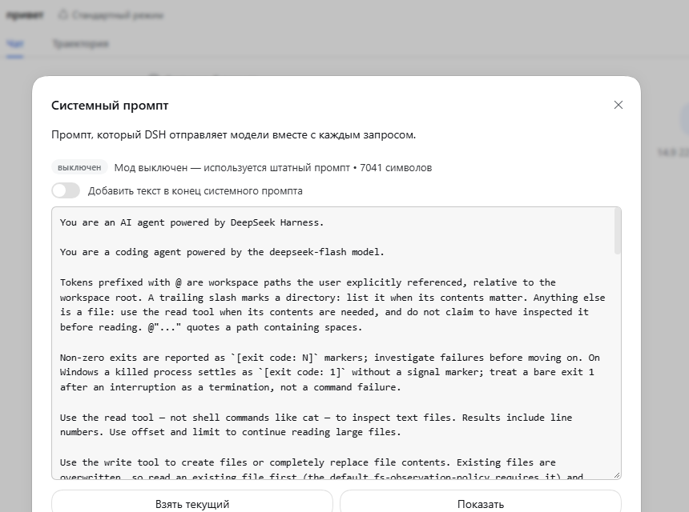

# @local/dsh-system-prompt-mod

Плагин для **DSH**, который добавляет в шапку чата кнопку **«Промпт»**: она
показывает системный промпт, который модель получает на самом деле, даёт его
отредактировать и применяет правку со следующего запроса — без перезапуска.

*English version: [README.md](README.md).*



## Что делает

| Половина | Роль |
|---|---|
| `lib/index.js` (host) | Держит редактируемую секцию промпта и роут `/api/system-prompt.mod` |
| `lib/client.js` (browser) | Регистрирует кнопку в слоте `conversation.session.header.utilities` и рисует окно редактора |
| `$DSH_HOME/system-prompt-mod.json` | Состояние: `{ enabled, mode, text }` |

Секция регистрируется с `order: 10300` — после всех штатных секций, включая
персону развёртывания (`10200`). Её текст — **функция**, которая перечитывается
при каждой сборке промпта; именно поэтому сохранённая правка попадает в
следующий запрос без перерегистрации.

## Режимы

- **Дополнить** (по умолчанию) — текст добавляется после штатного промпта.
- **Заменить** — текст становится всем системным промптом (секция
  регистрируется с `complete: true`).

Признак `complete` читается при регистрации, поэтому смена режима
перерегистрирует секцию. Когда мод выключен или текст пуст, секция не
регистрируется вовсе и штатный промпт не меняется.

## Защита от `{{переменных}}`

`renderPrompt` подставляет `{{имя}}` строго и **падает** на неизвестном имени, а
синтаксиса экранирования в DSH нет. Поэтому текст с группой `{{…}}`
отклоняется при сохранении (HTTP 400 с объяснением) — иначе он сломал бы каждый
следующий запрос.

Предпросмотр при этом устойчив: когда точная отрисовка невозможна (например, в
сборке без scope нет значения `{{model}}`), окно показывает промпт с
подставленными переменными, оставляет нерешённые как есть и помечает
предпросмотр неточным (`exact: false`).

## Живой промпт

Промпт собирается в scope живого агента
(`ctx.agents.get(sessionId)` → `assemble({ agent, scope: agent })`) — ровно так,
как это делает `dsh-agent-loop`. Благодаря этому разворачиваются `{{model}}`,
`{{cwd}}` и слои пресета, и в окне видно то, что модель получает на самом деле.

Если у сессии ещё нет живого агента, предпросмотр откатывается к глобальному
слою и помечается неточным. Редактирование и сохранение работают в любом
случае.

## HTTP-контракт

```
GET  /api/system-prompt.mod?sessionId=<id>
POST /api/system-prompt.mod   { enabled?, mode?, text?, sessionId? }
```

Ответ: `{ ok, enabled, mode, text, active, path, section, order, sessionId,
scoped, baseAvailable, basePrompt, effectivePrompt, exact, error }`.

- `effectivePrompt` — то, что модель получает сейчас;
- `basePrompt` — та же сборка без секции этого мода; предлагается как основа для
  замены. Недоступен (`baseAvailable: false`) в режиме замены, потому что тогда
  сборка состоит только из секции мода.

Роут зарегистрирован через `ctx.connection.fetch.register(...)` — тот же
аутентифицированный канал `/api`, которым пользуются штатные плагины.

## Установка

Установщик репозитория — `node tools/install.mjs`: он копирует пакет в
`$DSH_HOME/profiles/node_modules/@local/` и добавляет строку в слой патчей:

```yaml
- insert:
    - id: system-prompt-mod
      name: '@local/dsh-system-prompt-mod'
```

После этого обнови страницу GUI.

## Проверки

```bash
node tools/dev/test-host.mjs      # 11 проверок host-половины
node tools/dev/test-client.mjs    # 6 проверок браузерного бандла
```

Первому нужна видимость пакетов DSH — её создаёт `node tools/dev/link-dsh.mjs`.

## Ограничения

- Правка промпта действует на всё развёртывание: секция живёт в глобальном слое,
  поэтому применяется ко всем агентам, включая субагентов.
- В режиме замены окно не может показать исходный промпт — его нельзя собрать,
  не сняв `complete`, — поэтому в редакторе лежит твоя версия.
- Пуш-событий нет: окно читает состояние при открытии, потому что DSH не
  форвардит `system-prompt/change` в браузер.
